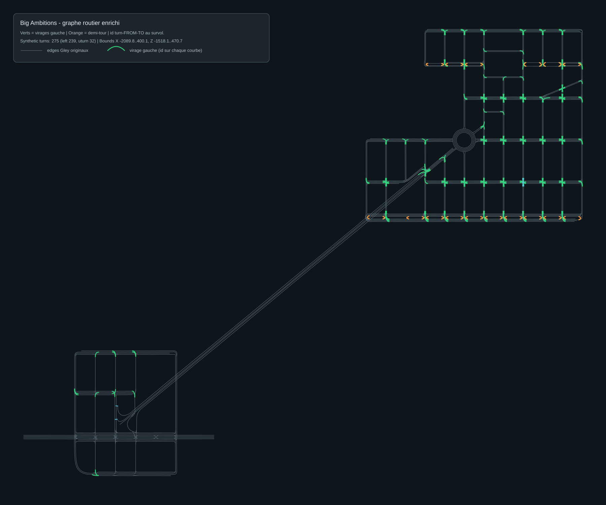

# VoogleRoute.Pathfinding

Shared **netstandard2.1** routing library for [Voogle Route](https://github.com/capisoft-lib/BigAmbitions_VoogleRoute) (Unity mod) and [Voogle Route Web](https://github.com/capisoft-lib/BigAmbitions_VoogleRoute.Web).

| Property | Value |
|----------|-------|
| **Target** | .NET Standard 2.1 |
| **Assembly** | `VoogleRoute.Pathfinding.dll` |
| **Algorithm** | A* on a precomputed traffic waypoint graph |

## Repository layout

```text
Graph/ Routing/ Geometry/     C# library sources
  Geometry/VehicleRoutePolyline.cs   A* + polyline (single source of truth for display)
Tests/                         xUnit vehicle routing (4 rules × multiple scenarios)
data/                          shipped route graph CSV (source of truth)
tools/generate_enhanced_route_graph.py
tools/sync-route-data.ps1      copy data/*.csv into a mod checkout
docs/big_ambitions_enhanced_route_graph.svg
DiagRunner/                    optional offline diagnostics
```

## Build

```powershell
dotnet build VoogleRoute.Pathfinding.csproj -c Release
```

Output: `bin/Release/netstandard2.1/VoogleRoute.Pathfinding.dll`

## Unit tests (vehicle routing)

xUnit project under `Tests/` — vehicle and outdoor foot routing.

```powershell
dotnet test VoogleRoute.Pathfinding.sln -c Release
```

**Vehicle:** 8 scenarios × 4 rule combos + Third & 45th goldens + 28 waypoint probes (bridge/industrial/north).

**Foot (outdoor):** vanilla-complete direct walk first; subway fallback when direct is unreachable; edge cases (partial, radius).

**Graph:** node count, CSV edge mix, critical reachability, isolated components.

```powershell
dotnet test VoogleRoute.Pathfinding.sln -c Release
```

103 tests — exit code 0 required before routing changes ship.

Legacy console probes: `DiagRunner/` (`--scenario third45`, etc.).

## Consumers

| Project | Integration |
|---------|-------------|
| **[VoogleRoute mod](https://github.com/capisoft-lib/BigAmbitions_VoogleRoute)** | git submodule at `PathFinding/` → `tools/build-pathfinding.ps1` copies DLL to `Dependencies/` and CSV to `Data/` |
| **[VoogleRoute.Web](https://github.com/capisoft-lib/BigAmbitions_VoogleRoute.Web)** | `<ProjectReference>` to this `.csproj` |

Sync graph data into a mod checkout:

```powershell
.\tools\sync-route-data.ps1 -ModRoot "C:\path\to\BigAmbitions_VoogleRoute"
```

## Enhanced driving graph

Vanilla **Gley Traffic System** waypoints model forward lane connectivity well, but they do **not** expose every **left turn** or **U-turn** a driver needs at intersections. This project ships a precomputed graph extension so vehicle routing can turn onto cross streets instead of only going straight.

### Pipeline overview

```
In-game Gley waypoints (CurrentSceneData.allWaypoints)
        │
        ▼  export to CSV (listIndex, name, position, neighbors, …)
        │
        ▼  tools/generate_enhanced_route_graph.py
        │     • keep all base Gley edges (edgeType=base, source=gley)
        │     • detect intersection exits/entries per road lane
        │     • add synthetic_turn / left  (green curves on map)
        │     • add synthetic_turn / uturn (orange curves on map)
        │
        ▼  data/big_ambitions_enhanced_routes.csv
        │
        ▼  runtime: CsvRouteGraphLoader → RouteGraph → WaypointPathfinder
```

The [Voogle Route mod](https://github.com/capisoft-lib/BigAmbitions_VoogleRoute) receives `data/*.csv` via `tools/build-pathfinding.ps1` into its `Data/` folder at build time.

### Regenerate graph data

```bash
python tools/generate_enhanced_route_graph.py <waypoints_dump.csv> data/big_ambitions_enhanced_routes.csv docs/big_ambitions_enhanced_route_graph.svg
```

When a game update reorders waypoint indices, carry forward the hand-authored
corrections before applying the bridge/deck preprocessors:

```bash
python tools/migrate_legacy_manual_edges.py <old_enhanced.csv> <old_waypoints.csv> <new_waypoints.csv> data/big_ambitions_enhanced_routes.csv
```

See [`docs/beta1-road-refresh.md`](docs/beta1-road-refresh.md) for the complete
BA 1.0 beta sequence, portal remaps, and verification counts.

Then sync into the mod and rebuild:

```powershell
.\tools\sync-route-data.ps1 -ModRoot "..\.."   # when PathFinding is mod submodule
# or from mod root: .\tools\build-pathfinding.ps1
```

### Left turns and U-turns

**Left turns (`maneuver=left`)**

- Leftmost driving lanes at each road (lane-direction clustering).
- Intersection exit → entry pairing on other roads.
- Signed turn angle **+28° to +142°**.
- Skip pairs already reachable through the base graph (short BFS).
- Quadratic Bezier **control point** for smooth on-ground rendering.

**U-turns (`maneuver=uturn`)**

- Parallel corridor pairs: one authorized ~180° link per intersection station.
- Internal multi-lane roads: leftmost exit → leftmost entry when geometry is ~145°–181°.
- Whitelisted at runtime — generic ~180° turns on the base graph remain blocked.

### Map visualization

Grey = **Gley** edges. Green = **left turns**. Orange = **U-turns**.



## License

MIT
