# Impasses : comparaison du graphe avant/apres

Le commentaire ne donne ni adresse ni capture. Les lieux ci-dessous sont des candidats, pas une reproduction confirmee du mur du pont.

Preuve : donnees du graphe livre et polylignes calculees par le pathfinding C#. Ces dessins ne sont pas des captures du jeu et ne contiennent pas les collisions, trottoirs, murs ou rayons de braquage des vehicules.

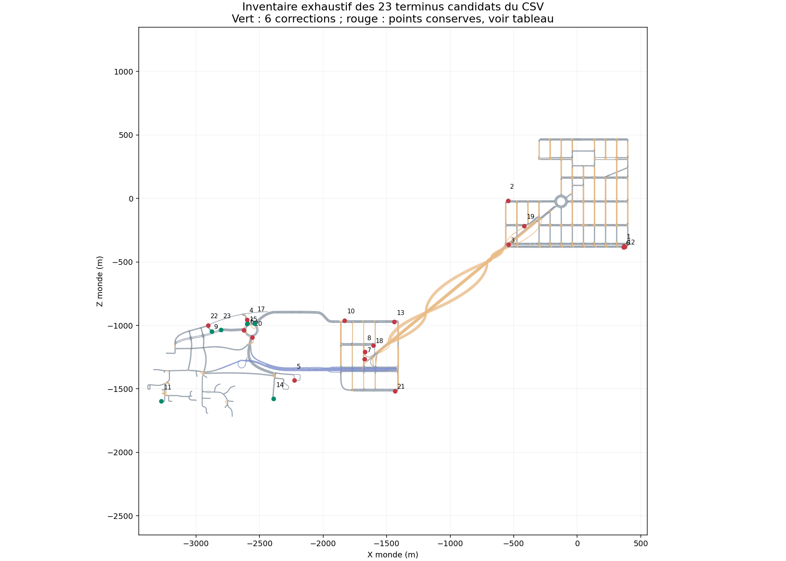

## Six corrections

Les virages restent sur la meme route et au meme niveau. Leur enveloppe est au moins 2 m en amont du plan passant par l'ancien terminus. Les 14 points de fin de voie d'approche sont retires pour ne plus servir de candidats de navigation apres le virage. Quinze aretes natives sont remplacees par six demi-tours autorises.

Road 246 avait deja une liaison native Waypoint -> Waypoint, mais elle n'etait pas reconnue comme demi-tour autorise. Les cinq autres terminus n'avaient aucune sortie directe.

R237, R222 et R233 sont des terminus explicites Out de voie interieure : une autre voie continue vers un raccord. Ils ne prouvent donc pas que toute la rue est physiquement bouchee. La correction autorise le retour sur la meme route depuis cette voie, sans inventer un passage vers le raccord voisin. Les fins intermediaires Waypoint et les voies exterieures restent distinctes dans l'audit.

| Route | Avant : longueur de polyligne | Apres | Demi-tour |
|---|---:|---:|---|
| 237 | Aucun trajet | 19.0 m | 10345 → 14484 |
| 222 | 635.7 m | 15.6 m | 5888 → 14398 |
| 230 | Aucun trajet | 21.0 m | 9644 → 6935 |
| 210 | Aucun trajet | 18.4 m | 17491 → 3923 |
| 233 | 1362.6 m | 17.4 m | 8144 → 2495 |
| 246 | Aucun trajet | 15.6 m | 8963 → 8311 |

### Road 237

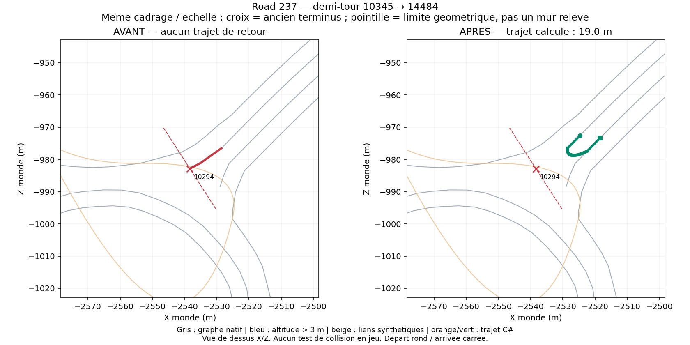

### Road 222

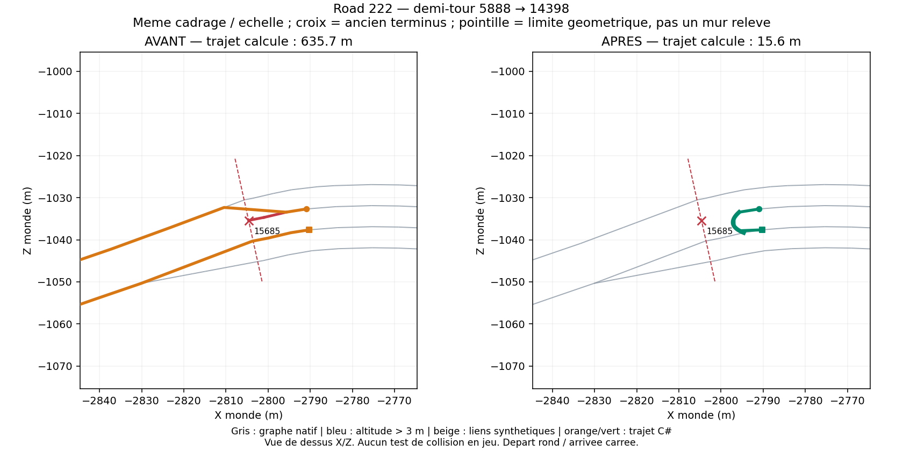

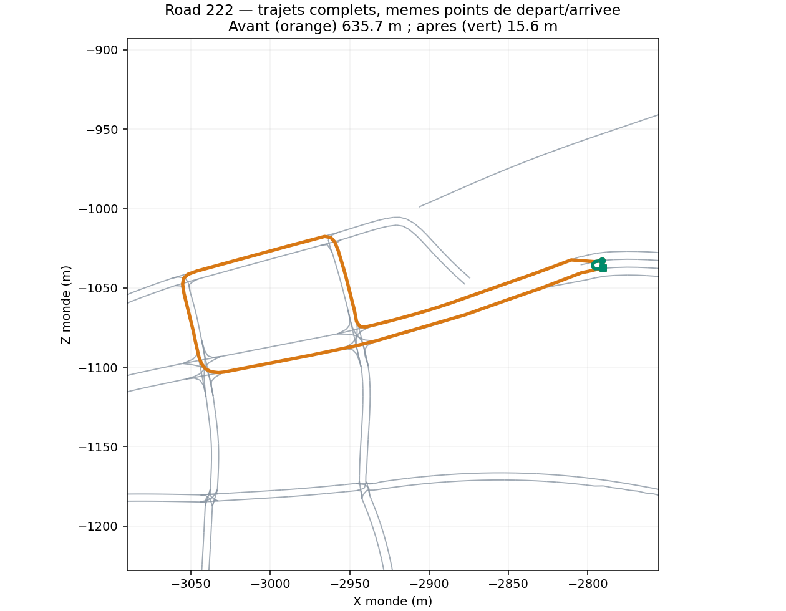

### Road 230

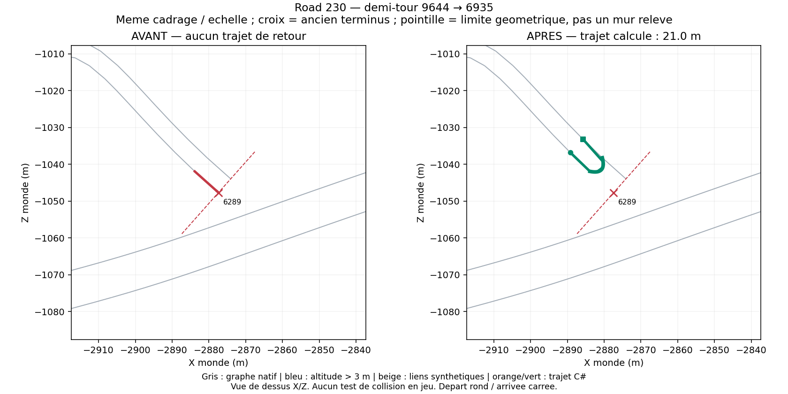

### Road 210

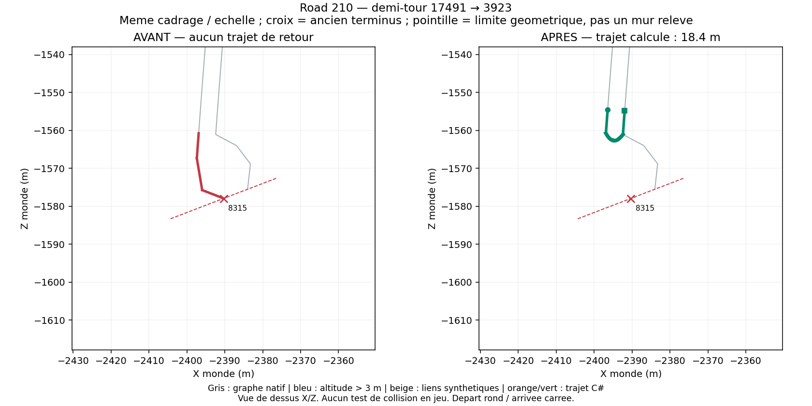

### Road 233

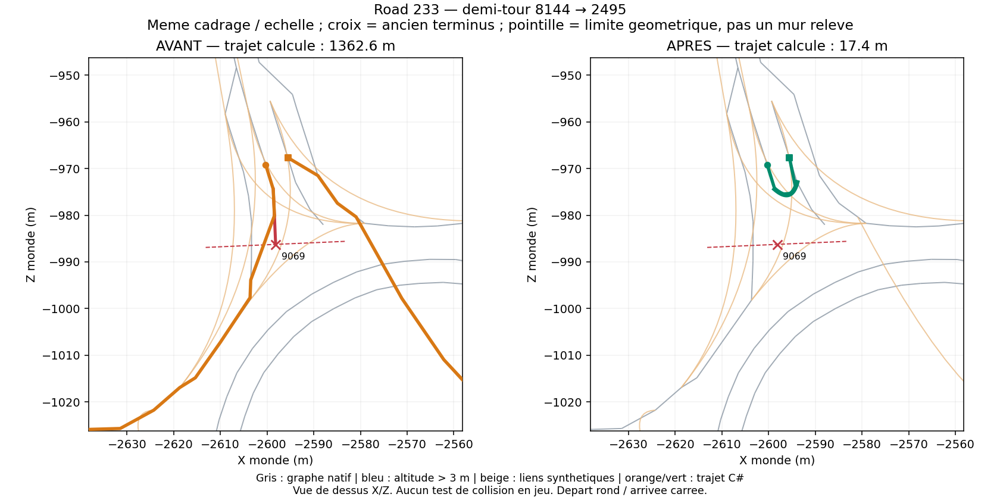

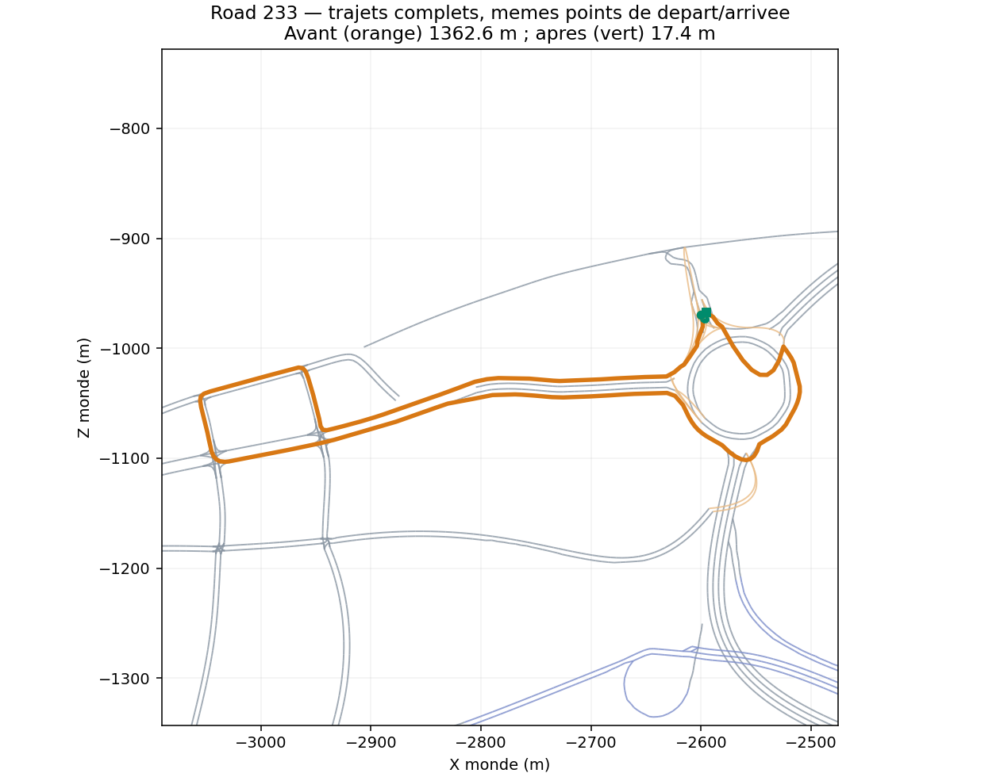

### Road 246

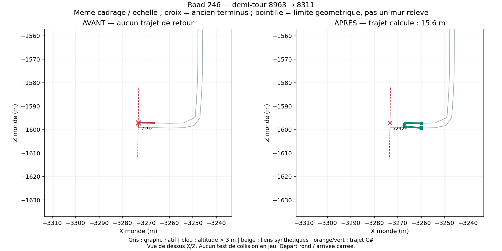

## Tous les candidats, y compris sans modification

Les dix fins de voie dont une voie adjacente continue ne justifient pas un demi-tour a travers les voies. Road 169, d'abord suspectee pres du pont, appartient a ce groupe. Road 235 n'a pas de voie retour identifiee : en inventer une ferait circuler a contresens. Les sorties synthetiques de R222 (10255), R233 (3193) et R214 (12828) restent a verifier sur le terrain ; leur absence du graphe natif ne suffit pas a prouver un mur.

| Repere | Road / waypoint | X, Y, Z (m) | Classement |
|---|---|---|---|
| 1 | R11 / 359 | 368.933, 0.010, -374.215 | Fin de voie ; voie adjacente continue |
| 2 | R120 / 550 | -545.664, 0.010, -17.103 | Fin de voie ; voie adjacente continue |
| 3 | R115 / 1003 | -539.410, 0.010, -363.692 | Fin de voie ; voie adjacente continue |
| 4 | R233 / 3193 | -2599.367, 0.000, -955.523 | Sortie synthetique seule : terrain a verifier |
| 5 | R213 / 3779 | -2227.948, 0.000, -1433.316 | Demi-tour Road 213 deja autorise |
| 6 | R11 / 5181 | 363.916, 0.010, -385.621 | Fin de voie ; voie adjacente continue |
| 7 | R1702 / 5225 | -1672.624, 0.200, -1266.441 | Raccord de pont manuel existant |
| 8 | R1701 / 5670 | -1669.936, 0.200, -1207.642 | Raccord de pont manuel existant |
| 9 | R230 / 6289 | -2877.386, -0.209, -1047.679 | Demi-tour corrige en amont |
| 10 | R166 / 6589 | -1831.616, 0.200, -961.832 | Fin de voie ; voie adjacente continue |
| 11 | R246 / 7292 | -3273.312, 0.050, -1597.040 | Demi-tour corrige en amont |
| 12 | R11 / 7331 | 374.814, 0.010, -381.807 | Fin de voie ; voie adjacente continue |
| 13 | R156 / 7894 | -1439.356, 0.200, -972.187 | Fin de voie ; voie adjacente continue |
| 14 | R210 / 8315 | -2390.312, -0.008, -1577.938 | Demi-tour corrige en amont |
| 15 | R233 / 9069 | -2598.166, 0.000, -986.245 | Demi-tour corrige en amont |
| 16 | R222 / 10255 | -2623.886, 0.000, -1038.250 | Sortie synthetique seule : terrain a verifier |
| 17 | R237 / 10294 | -2538.379, 0.000, -982.847 | Demi-tour corrige en amont |
| 18 | R169 / 10895 | -1605.524, 0.200, -1157.251 | Fin de voie ; voie adjacente continue |
| 19 | R118 / 12094 | -416.861, 0.010, -216.531 | Fin de voie ; voie adjacente continue |
| 20 | R214 / 12828 | -2559.130, 0.000, -1095.277 | Sortie synthetique seule : terrain a verifier |
| 21 | R151 / 12855 | -1434.388, 2.000, -1518.063 | Fin de voie ; voie adjacente continue |
| 22 | R235 / 15651 | -2906.436, -0.209, -998.989 | Voie unique : retour non etabli |
| 23 | R222 / 15685 | -2804.638, 0.019, -1035.410 | Demi-tour corrige en amont |

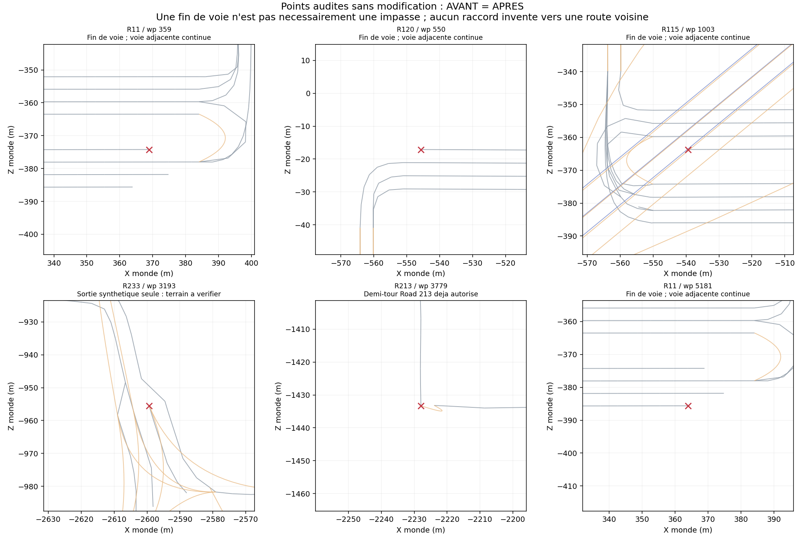

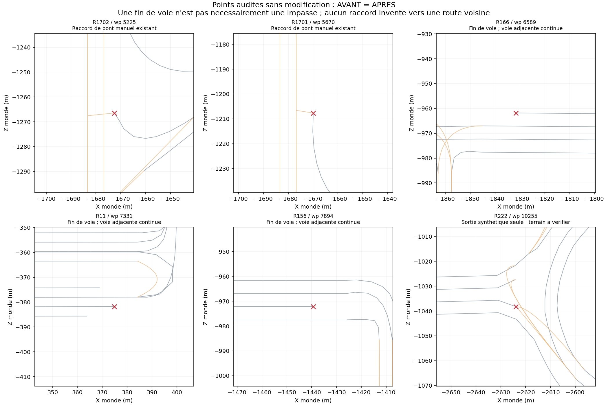

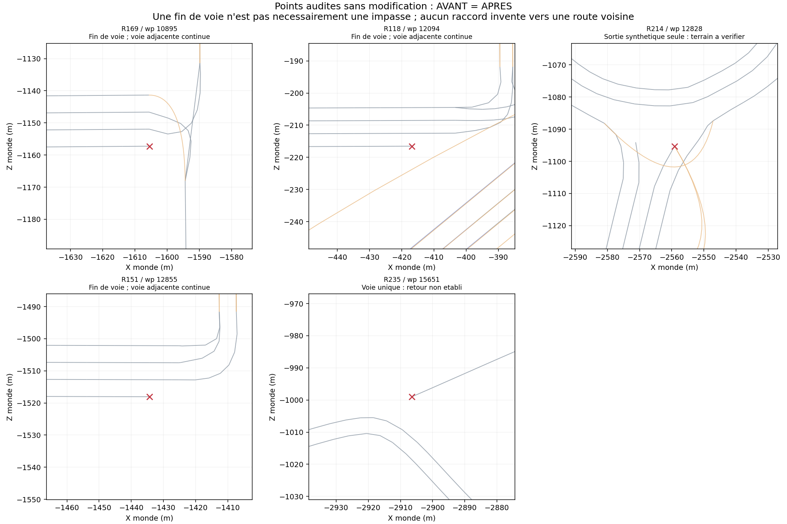

## Reproduction

Baseline PathFinding : `793a005fad5989d09e5713a7cbaa6d9d82310a9a`. Extraire son `data/big_ambitions_enhanced_routes.csv` vers `before.csv`.

```text
python tools/repair_deadend_turns.py data/big_ambitions_enhanced_routes.csv
dotnet run --project DiagRunner -c Release -- before.csv --scenario deadends --output before-routes.json
dotnet run --project DiagRunner -c Release -- data/big_ambitions_enhanced_routes.csv --scenario deadends --output after-routes.json
python tools/render_deadend_review.py before.csv data/big_ambitions_enhanced_routes.csv before-routes.json after-routes.json docs/navigation-deadends
```

Les exports JSON contiennent les vrais indices A* et les points de la polyligne. Les images locales utilisent exactement le meme cadrage avant/apres ; les deux longs detours ont aussi une vue integrale.
